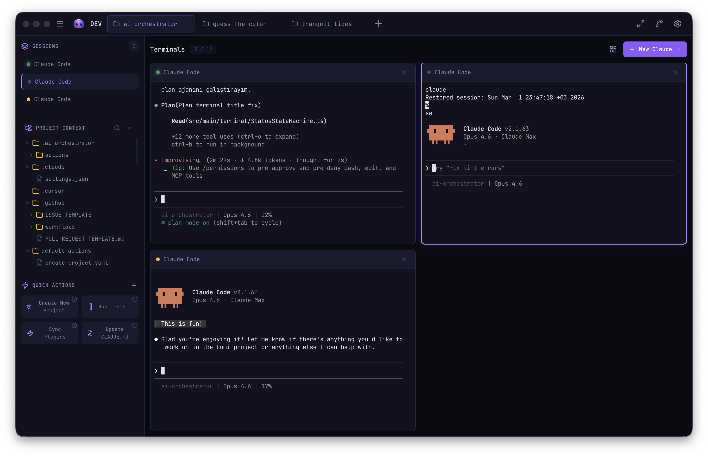

[](https://github.com/szigen/lumi/actions)
[](https://github.com/szigen/lumi/releases/latest)
[](LICENSE)

<p align="center">
  
</p>

<h1 align="center">Lumi</h1>

<p align="center">
  Mission control for your AI coding terminals.<br>
  Run multiple <a href="https://code.claude.com/docs/en/setup">Claude Code</a> or <a href="https://github.com/openai/codex">Codex CLI</a> sessions side-by-side, from one dashboard.
</p>

<p align="center">
  
</p>

## Download

| Platform | Installer | Portable |
|----------|-----------|----------|
| macOS (Apple Silicon) | [Lumi-0.2.0-arm64-mac.dmg](https://github.com/szigen/lumi/releases/download/v0.2.0/Lumi-0.2.0-arm64-mac.dmg) | [.zip](https://github.com/szigen/lumi/releases/download/v0.2.0/Lumi-0.2.0-arm64-mac.zip) |
| Windows | [Lumi-Setup-0.2.0-win.exe](https://github.com/szigen/lumi/releases/download/v0.2.0/Lumi-Setup-0.2.0-win.exe) | [.exe](https://github.com/szigen/lumi/releases/download/v0.2.0/Lumi-0.2.0-win.exe) |
| Linux (x86_64) | [Lumi-0.2.0-linux-x86_64.AppImage](https://github.com/szigen/lumi/releases/download/v0.2.0/Lumi-0.2.0-linux-x86_64.AppImage) | [.deb](https://github.com/szigen/lumi/releases/download/v0.2.0/Lumi-0.2.0-linux-amd64.deb) |
| Linux (ARM64) | [Lumi-0.2.0-linux-arm64.AppImage](https://github.com/szigen/lumi/releases/download/v0.2.0/Lumi-0.2.0-linux-arm64.AppImage) | [.deb](https://github.com/szigen/lumi/releases/download/v0.2.0/Lumi-0.2.0-linux-arm64.deb) |

> All downloads are available on the [Releases](https://github.com/szigen/lumi/releases) page.

## Quick Start

1. **Install an AI CLI** — [Claude Code](https://code.claude.com/docs/en/setup) or [OpenAI Codex CLI](https://github.com/openai/codex)
2. **Download Lumi** — grab the installer for your platform above
3. **Open, pick a repo, go** — launch Lumi, select a repository, and start coding with AI

<details>
<summary><strong>macOS installation notes</strong></summary>

**DMG (recommended):**
1. Download the `.dmg` file
2. Open it and drag **Lumi** into your **Applications** folder
3. Launch Lumi and select a repository to start

**Portable (ZIP):**
1. Extract the `.zip` file
2. Run `Lumi.app` directly — no installation needed

</details>

<details>
<summary><strong>Windows installation notes</strong></summary>

1. Download `Lumi-Setup-0.2.0-win.exe`
2. Run the installer — Windows SmartScreen may show a warning since Lumi is unsigned. Click **"More info"** → **"Run anyway"** to proceed
3. Choose the installation directory and complete the setup
4. Launch from the Start Menu or Desktop shortcut

> **Portable:** Download `Lumi-0.2.0-win.exe` and run it directly — no installation needed. The same SmartScreen warning applies.

</details>

<details>
<summary><strong>Linux (x86_64) installation notes</strong></summary>

**AppImage (recommended):**
```bash
chmod +x Lumi-0.2.0-linux-x86_64.AppImage
./Lumi-0.2.0-linux-x86_64.AppImage
```

**DEB package (Debian/Ubuntu):**
```bash
sudo dpkg -i Lumi-0.2.0-linux-amd64.deb
```

> If you get a sandbox error, either run with the `--no-sandbox` flag or set the environment variable:
> ```bash
> ELECTRON_DISABLE_SANDBOX=1 ./Lumi-0.2.0-linux-x86_64.AppImage
> ```

</details>

<details>
<summary><strong>Linux (ARM64) installation notes</strong></summary>

For ARM64 devices (Raspberry Pi, ARM Chromebooks, ARM cloud VMs, etc.):

**AppImage (recommended):**
```bash
chmod +x Lumi-0.2.0-linux-arm64.AppImage
./Lumi-0.2.0-linux-arm64.AppImage
```

**DEB package (Debian/Ubuntu):**
```bash
sudo dpkg -i Lumi-0.2.0-linux-arm64.deb
```

> If you get a sandbox error, either run with the `--no-sandbox` flag or set the environment variable:
> ```bash
> ELECTRON_DISABLE_SANDBOX=1 ./Lumi-0.2.0-linux-arm64.AppImage
> ```

</details>

---

<details>
<summary><strong>Features</strong></summary>

- **Multi-terminal management** — Up to 20 parallel AI sessions, each with its own terminal
- **Multi-provider support** — Claude Code and OpenAI Codex CLI, switchable in Settings
- **Action system** — Reusable YAML-based workflows with AI-assisted editing and auto-backup
- **Persona system** — Predefined AI personas (architect, reviewer, fixer, expert) with custom system prompts
- **Git integration** — Branch management, file-changes view, and commit history per repo
- **Multi-repo support** — Tab-based navigation across repositories
- **Smart terminal status** — Activity detection via OSC9 signals with native notifications
- **Keyboard shortcuts** — Platform-adaptive (`Cmd` on macOS, `Ctrl+Shift` on Windows/Linux)

</details>

<details>
<summary><strong>Development</strong></summary>

### Prerequisites

- **Node.js** 22+ (required by Vite 7 — `crypto.hash()` API)
- **AI CLI** — [Claude Code](https://code.claude.com/docs/en/setup) or [OpenAI Codex CLI](https://github.com/openai/codex)
- **macOS**, **Windows**, or **Linux**

> **Note:** Lumi uses [node-pty](https://github.com/nicktaf/node-pty) for terminal emulation,
> which requires native compilation. On macOS, Xcode Command Line Tools are needed.
> On Linux, install `build-essential` and `python3`. On Windows, install
> [Visual Studio Build Tools](https://visualstudio.microsoft.com/downloads/).

### Build from source

```bash
git clone https://github.com/szigen/lumi.git
cd lumi
npm install
npm run dev            # Development mode (Vite + Electron with HMR)
# On Linux: npm run dev:linux
```

### Commands

```bash
npm run build          # Production build
npm test               # Vitest unit tests
npm run lint           # ESLint
npm run typecheck      # TypeScript type checking
```

### Tech Stack

Electron 40 · React 19 · Zustand 5 · xterm.js 6 · node-pty · Framer Motion 12 · simple-git · Monaco Editor 4 · Vite 7

</details>

## Contributing

Contributions welcome — please read the [Contributing Guide](CONTRIBUTING.md) first. Found a vulnerability? See our [Security Policy](SECURITY.md).

## License

[MIT](LICENSE) — szigen
